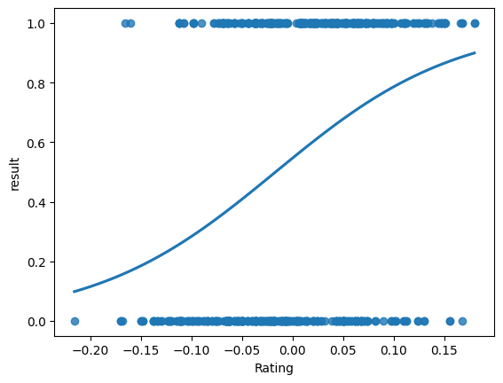

<div class="cell markdown">

In this project I am performing CS2 matches prediction based on players
performance in last 2 months.

Technologies and frameworks used:  
*Python  
*Selenium  
*Pandas  
*Sqlalchemy  
*PostgreSQL  
*XGBoost

Data for all of the teams and players is gathered using webscraping from
several websites, including passing through CloudFlare captcha. Data is
organized and stored in PostgreSQL database to ensure integrity,
consistency, efficient retrieval and scalability.

Model after optimalization achieved high precision of 0.685 in test
data, and it doesnt show overfitting

Database model look as follows

<div class="db_model">


</div>

</div>

<div class="cell code" execution_count="10">

``` python
from pre_process_data import make_training_data
data = make_training_data()
data.info()
```

<div class="output stream stdout">

    <class 'pandas.core.frame.DataFrame'>
    RangeIndex: 623 entries, 0 to 622
    Data columns (total 8 columns):
     #   Column        Non-Null Count  Dtype  
    ---  ------        --------------  -----  
     0   Team1_id      623 non-null    int64  
     1   Team2_id      623 non-null    int64  
     2   result        623 non-null    bool   
     3   Rating        623 non-null    float64
     4   Kda           623 non-null    float64
     5   openRating    623 non-null    float64
     6   pistolRating  623 non-null    float64
     7   last10m       623 non-null    float64
    dtypes: bool(1), float64(5), int64(2)
    memory usage: 34.8 KB

</div>

</div>

<div class="cell markdown">

Data consist features of mean of team players statistics divided from
the mean values from opposite team.

</div>

<div class="cell code" execution_count="11">

``` python
data.head()
```

<div class="output execute_result" execution_count="11">

       Team1_id  Team2_id  result  Rating    Kda  openRating  pistolRating  last10m
    0        28        39    True   0.024  0.032      -0.016        -0.072      1.0
    1       143        66    True   0.084  0.112       0.018         0.024     42.0
    2        20        54   False  -0.032 -0.048      -0.044        -0.052     12.0
    3         5        67    True   0.082  0.084       0.038         0.040      0.0
    4        34        97   False   0.072  0.096       0.014         0.166      2.0

</div>

</div>

<div class="cell markdown">

Variable rating is value of players calculated by hltv of overall Player
performance. Kda is Kill/death/assist ratio from player matches.
openRating is the rating of player getting opening(first) kills in round
pistolRating is the rating of player performing in pistol rounds last10m
is Team performance in last 10 matches

Variable,Kda,openRating and pistolRating are calculated by getting the
average of all players from team and then dividing values of Team1 minus
Team2

</div>

<div class="cell code" execution_count="12">

``` python
import seaborn as sns
import matplotlib.pyplot as plt
y=data['result'].astype(int)
X=data[["Rating","Kda","openRating","pistolRating","last10m"]].astype(float)

for i in X.columns:
    sns.regplot(x=X[i],y=y,logistic=True,ci=None)
    plt.show()
```

<div class="output display_data">



</div>

<div class="output display_data">


</div>

<div class="output display_data">


</div>

<div class="output display_data">


</div>

<div class="output display_data">


</div>

</div>

<div class="cell markdown">

Plots show that teams with higher values tends to perform better and win
more matches

</div>

<div class="cell code" execution_count="13">

``` python
from xgboost import XGBClassifier
model = XGBClassifier()
model.load_model("xgb_matches1.json")
model.feature_importances_
```

<div class="output execute_result" execution_count="13">

    array([0.18995626, 0.14972827, 0.07406306, 0.09058215, 0.4956702 ],
          dtype=float32)

</div>

</div>

<div class="cell code" execution_count="14">

``` python
from sklearn.metrics import roc_curve, roc_auc_score
from sklearn.model_selection import train_test_split
from predictor2 import get_roc_plot
X_train,X_test,y_train,y_test = train_test_split(X,y,train_size=0.7,random_state=1)

get_roc_plot(model,X_train,X_test,y_train,y_test)
```

<div class="output display_data">


</div>

<div class="output stream stdout">

    Precision: 0.6857142857142857

</div>

</div>

<div class="cell markdown">

Metrics shows that model predicts winning team with high ratio.
Overfitting of model is not observed.

In evaluating model we focus more on its precision because the false
positive can result in losing money while betting. With this precision
optimal betting using Kelly's criterion should result in continious
profit

</div>
